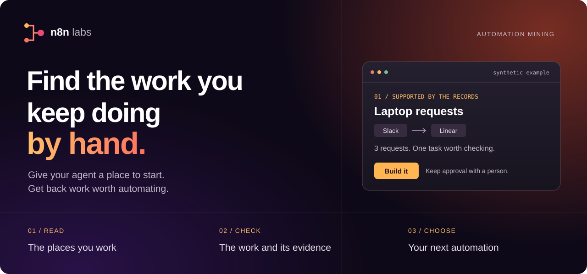
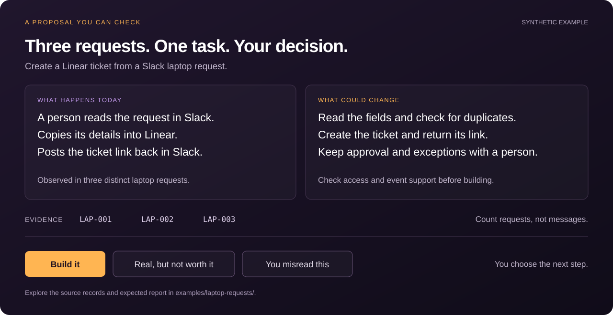

<p align="center">
  
</p>

<p align="center">
  <a href="https://automation-mining-skill.pages.dev/">Website</a> ·
  <a href="#quick-start"><strong>Get started</strong></a> ·
  <a href="examples/laptop-requests/README.md">Try the example</a> ·
  <a href="docs/installation.md">Installation guide</a> ·
  <a href="paper/taxonomy_skill.pdf">Read the paper</a>
</p>

# Automation mining

**Find repeated manual work. Decide what to automate.**

The request copied from chat into a tracker. The same lookup typed into another
reply. The report assembled from several tools each week. Automation mining
helps your agent find these tasks in activity records and propose a change you
can review.

You get **up to five proposals**, each with source references, a count of distinct
work instances, the proposed automation, and the work that still needs a person.
You choose which proposals deserve a build.

An **n8n labs** experiment for agents that support [Agent Skills](https://agentskills.io/home).
Available under the [MIT License](LICENSE). The package contains instructions
and reference files; your agent supplies the model and tool connections.

## Quick start

**Try it without connecting work data.** Give your agent the
[skill](skills/automation-mining/SKILL.md) and the
[synthetic activity file](examples/laptop-requests/activity.json), then ask:

> Use automation-mining on the supplied activity.json. These records are
> synthetic. The owner is unavailable. Read only the supplied records and
> write the report as JSON to report.json.

The records support three laptop requests and one proposal. Follow the
[example guide](examples/laptop-requests/README.md) to check the result and try
records that support no proposal. This checks basic behavior, not performance
on your work.

**Install for your own work** with [Skills CLI](https://www.skills.sh/docs/cli):

```sh
npx skills@latest add n8n-io/automation-mining-skill --skill automation-mining
```

You need Node.js, Git, and a supported agent. Choose your agent and installation
scope, then start a new session. For Claude Code, Codex, Pi, local installation,
and release ZIP files, see the [installation guide](docs/installation.md).

**Release status:** version 1.0.0 is in preparation. The Git command requires the
skill to be merged into `main`. The Codex marketplace package and release ZIP
files require the first version tag. GitHub access is required while the
repository is private. You can try the files in this checkout now.

## Start with one place you work

Use this when you own a process and want to identify manual work before choosing
an automation. Start with a clear source and time window:

| Your starting point | What to ask |
| --- | --- |
| Agent session files your agent can read | "Find repeated manual work in these sessions from the last two weeks." |
| A team channel you belong to | "Use automation-mining on #ops-requests for the last 30 days. I handle operations for the team." |
| Supplied work records | "Use automation-mining on these request records. I want to see where we copy information by hand." |

Connect sources through your agent, or provide files it can read. The skill
does not install connectors. For real work, you review the first findings and
choose which ones to investigate. If you already know what to build, give that
specification directly to your builder.

## A proposal you can check

In the synthetic example, a person copies three laptop requests from Slack into
Linear and posts the ticket links back. The proposal creates those tickets and
returns their links. Approval and exceptions stay with a person.



Each proposal makes five things explicit:

- **The observed work:** the operation a person performed and its source records.
- **The count:** distinct work instances, separate from messages or threads.
- **The proposed change:** input, action, and output.
- **The limits:** remaining human work, missing evidence, and unverified access.
- **Your decision:** build it, real but not worth it, or the agent misread it.

A report can be empty. Activity volume alone does not establish manual work,
and work already done by a successful automation does not need another proposal.

## From evidence to a build decision

1. **Choose the scope.** State your role, source, and time window. The agent
   checks what it can read.
2. **Review early findings.** Keep, drop, or investigate a candidate. Approve
   access to another source when the evidence points there.
3. **Check the proposal.** Review the work count, source references, proposed
   change, and remaining human decisions.
4. **Choose the next step.** An accepted proposal becomes a starting
   specification for an [n8n workflow](https://n8n.io/) or another build tool.
   Building is a separate task.

Run time and model cost depend on the agent, tools, and number of records.
A proposal is not proof of feasibility or time saved. Check access, event
support, and exception handling before building.

## What the study measured

The included procedure was tested on **57 synthetic companies** with two reader
models. Feedback changed the instructions; model weights stayed fixed.

| Measure | Starting skill | Included procedure | Change, with 95% interval |
| --- | ---: | ---: | ---: |
| Useful proposal quality | 44.7% | 53.0% | +8.3 points [0.3, 16.8] |
| Verified task recall | 28.2% | 51.7% | +23.5 points [13.0, 34.4] |

These results compare the revised procedure with the starting skill on the same
test companies. A separate short-prompt comparison did **not** establish a
quality gain. A later instruction revision failed its release rule, so the
package retains the confirmed procedure.

The study tests fixed synthetic exports. It does not measure the full
interactive flow, user demand, or time saved in use. Real records use the owner
review flow; explicitly synthetic records use the tested procedure.

[LaTeX source](paper/taxonomy_skill.tex) · [Paper PDF](paper/taxonomy_skill.pdf) ·
[Method and limits](METHOD.md) · [Study records](research/README.md) · [Citation](CITATION.cff)

## Your data and your control

The skill instructs the agent to read source activity without posting, editing,
or reacting. It requires reports to use source references and counts instead
of copied message bodies, personal data, or credentials. Review the report
before you share it.

These are instructions, not an access-control system. Your agent, tools, and
model provider process data under your account settings. Set read permissions
in the connected tools. Use your own work or a channel you belong to, and tell
the channel before mining its activity.

## Help improve the skill

An installation failure, a wrong count, or a proposal that leaves the manual
work in place is useful feedback. [Open an issue](https://github.com/n8n-io/automation-mining-skill/issues/new?template=feedback.yml)
with your agent version and a synthetic example. Do not share private activity
or session exports.

[Contribute](CONTRIBUTING.md) · [Security](SECURITY.md) ·
[Build and release](docs/distribution.md) · [Changelog](CHANGELOG.md) · [MIT License](LICENSE)
